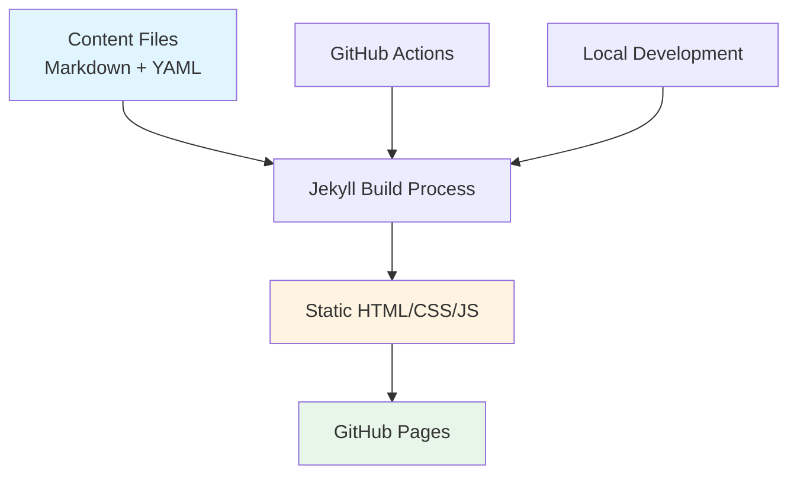
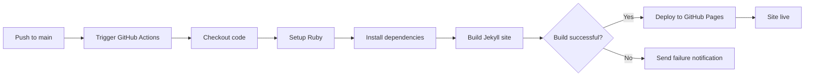

# Design Document

## Overview

This design outlines a Jekyll-based static website that serves as a unified platform for three town attractions. The site will use Jekyll's collection feature to manage attraction content, leverage layouts and includes for consistency, and deploy automatically via GitHub Actions to GitHub Pages. The architecture prioritizes simplicity, maintainability, and ease of content updates.

## Architecture

### High-Level Architecture



### Technology Stack

- **Static Site Generator**: Jekyll 4.x
- **Templating**: Liquid
- **Styling**: CSS (with optional Sass preprocessing via Jekyll)
- **CI/CD**: GitHub Actions
- **Hosting**: GitHub Pages
- **Local Development**: Ruby + Bundler on macOS

### Design Decisions

1. **Jekyll Collections for Attractions**: Using Jekyll collections rather than posts or pages allows for structured attraction data with custom fields and easy iteration
2. **Minimal Theme Approach**: Building a custom minimal theme rather than using a pre-built theme provides full control and reduces bloat
3. **GitHub Actions for Deployment**: Using the official Jekyll GitHub Actions workflow ensures reliable builds and deployments
4. **Data-Driven Navigation**: Navigation will be generated from site data to maintain consistency and reduce manual updates

## Components and Interfaces

### Directory Structure

```
.
├── _attractions/              # Collection for attraction content
│   ├── attraction-1.md
│   ├── attraction-2.md
│   └── attraction-3.md
├── _layouts/                  # Page templates
│   ├── default.html          # Base layout with header/footer
│   ├── home.html             # Homepage layout
│   └── attraction.html       # Attraction page layout
├── _includes/                 # Reusable components
│   ├── header.html           # Site header with navigation
│   ├── footer.html           # Site footer
│   └── attraction-card.html  # Attraction preview card
├── _sass/                     # Sass stylesheets
│   ├── _base.scss
│   ├── _layout.scss
│   └── _attractions.scss
├── assets/                    # Static assets
│   ├── css/
│   │   └── main.scss
│   ├── images/
│   └── js/
├── .github/
│   └── workflows/
│       └── jekyll.yml        # GitHub Actions workflow
├── _config.yml               # Jekyll configuration
├── Gemfile                   # Ruby dependencies
├── README.md                 # Setup and usage instructions
└── index.md                  # Homepage
```

### Jekyll Configuration (_config.yml)

Key configuration elements:

```yaml
title: "Town Attractions"
description: "Discover the best attractions in our town"
baseurl: ""
url: "https://username.github.io"

collections:
  attractions:
    output: true
    permalink: /:collection/:name/

defaults:
  - scope:
      path: ""
      type: "attractions"
    values:
      layout: "attraction"

plugins:
  - jekyll-seo-tag
  - jekyll-sitemap
```

### Attraction Content Model

Each attraction will be a Markdown file in the `_attractions/` directory with YAML front matter:

```yaml
---
layout: attraction
title: "Attraction Name"
tagline: "Brief tagline"
description: "Full description of the attraction"
hours:
  monday: "9:00 AM - 5:00 PM"
  tuesday: "9:00 AM - 5:00 PM"
  # ... other days
location:
  address: "123 Main St"
  city: "Town Name"
  state: "State"
  zip: "12345"
contact:
  phone: "(555) 123-4567"
  email: "info@attraction.com"
  website: "https://attraction.com"
image: "/assets/images/attraction-1.jpg"
order: 1
---

Additional content in Markdown format...
```

### Layout Components

#### Default Layout (_layouts/default.html)

Base template providing:
- HTML structure
- Meta tags (with jekyll-seo-tag)
- Header include
- Content area
- Footer include
- Responsive viewport meta tag

#### Home Layout (_layouts/home.html)

Extends default layout with:
- Hero section with town overview
- Grid of attraction cards
- Iterates through attractions collection sorted by order

#### Attraction Layout (_layouts/attraction.html)

Extends default layout with:
- Hero image
- Attraction title and tagline
- Description section
- Hours of operation table
- Location information with map placeholder
- Contact information
- Additional Markdown content

### Navigation Component (_includes/header.html)

Features:
- Site title/logo linking to homepage
- Navigation menu with links to:
  - Home
  - Each attraction (dynamically generated from collection)
- Active page indicator
- Mobile-responsive hamburger menu (CSS-only or minimal JS)

### Responsive Design Strategy

Using mobile-first CSS approach:

1. **Base styles**: Optimized for mobile (320px+)
2. **Tablet breakpoint** (768px): Adjust layout for medium screens
3. **Desktop breakpoint** (1024px): Multi-column layouts, expanded navigation

Key responsive elements:
- Flexible grid system using CSS Grid or Flexbox
- Fluid typography with relative units (rem, em)
- Responsive images with max-width: 100%
- Mobile-friendly navigation (hamburger menu)

## Data Models

### Attraction Model

| Field | Type | Required | Description |
|-------|------|----------|-------------|
| title | String | Yes | Attraction name |
| tagline | String | No | Brief tagline |
| description | String | Yes | Full description |
| hours | Object | Yes | Operating hours by day |
| location | Object | Yes | Address information |
| contact | Object | Yes | Contact details |
| image | String | Yes | Path to hero image |
| order | Integer | Yes | Display order on homepage |

### Site Configuration Model

| Field | Type | Required | Description |
|-------|------|----------|-------------|
| title | String | Yes | Site title |
| description | String | Yes | Site description |
| baseurl | String | Yes | Base URL path |
| url | String | Yes | Full site URL |

## Error Handling

### Build Errors

- **Missing required fields**: Jekyll will fail to build if required front matter fields are missing
- **Invalid YAML**: Jekyll will report YAML parsing errors with line numbers
- **Missing layouts**: Jekyll will error if a referenced layout doesn't exist

### GitHub Actions Error Handling

- Build failures will prevent deployment
- GitHub Actions will send email notifications on failure
- Build logs will be available in the Actions tab for debugging

### Local Development Errors

- Jekyll will display error messages in the terminal
- Live reload will pause until errors are fixed
- Common errors (missing dependencies, port conflicts) will be documented in README

## Testing Strategy

### Manual Testing Checklist

1. **Content Rendering**
   - Verify all three attractions display correctly
   - Check that all front matter fields render properly
   - Confirm Markdown content is converted to HTML

2. **Navigation**
   - Test all navigation links work
   - Verify active page indicator functions
   - Check mobile navigation menu

3. **Responsive Design**
   - Test on mobile viewport (375px)
   - Test on tablet viewport (768px)
   - Test on desktop viewport (1440px)

4. **Cross-Browser Testing**
   - Test in Safari (primary for macOS)
   - Test in Chrome
   - Test in Firefox

5. **Build Process**
   - Verify local build completes without errors
   - Confirm GitHub Actions build succeeds
   - Check deployed site on GitHub Pages

### Validation

- HTML validation using W3C validator
- CSS validation
- Accessibility check using browser dev tools
- Mobile-friendly test using Google's tool

## Deployment Pipeline

### Local Development Workflow

1. Clone repository
2. Install Ruby and Bundler (via Homebrew on macOS)
3. Run `bundle install` to install dependencies
4. Run `bundle exec jekyll serve` to start local server
5. Access site at `http://localhost:4000`
6. Make changes and preview live

### GitHub Actions Workflow



### GitHub Actions Configuration

The workflow will:
1. Trigger on push to main branch
2. Use `actions/jekyll-build-pages` action
3. Build the Jekyll site
4. Deploy to GitHub Pages using `actions/deploy-pages`
5. Use Ruby 3.x for compatibility

## Documentation Requirements

### README.md Contents

1. **Project Overview**: Brief description of the site
2. **Prerequisites**: Ruby, Bundler, macOS requirements
3. **Local Setup Instructions**:
   - Installing Homebrew (if needed)
   - Installing Ruby via Homebrew
   - Installing Bundler
   - Cloning the repository
   - Installing dependencies
   - Running the local server
4. **Content Management Guide**:
   - How to edit attraction content
   - Front matter field descriptions
   - Adding images
5. **Deployment**: Explanation of automatic deployment via GitHub Actions
6. **Troubleshooting**: Common issues and solutions

### Inline Code Comments

- Comment complex Liquid logic
- Document layout inheritance
- Explain responsive breakpoints in CSS

## Performance Considerations

- **Static files**: No server-side processing means fast load times
- **Image optimization**: Recommend compressed images (WebP with fallbacks)
- **Minimal dependencies**: Only essential Jekyll plugins
- **CSS**: Single compiled stylesheet, minified in production
- **No JavaScript frameworks**: Vanilla JS only if needed, keeping bundle size minimal

## Accessibility Considerations

- Semantic HTML5 elements
- Proper heading hierarchy (h1-h6)
- Alt text for all images
- ARIA labels for navigation
- Sufficient color contrast
- Keyboard navigation support
- Focus indicators for interactive elements

## Future Extensibility

While not in the initial scope, the design supports:
- Adding more attractions (just add new files to `_attractions/`)
- Custom domains via GitHub Pages
- Additional page types (events, news)
- Integration with Google Maps API
- Contact forms (via third-party services like Formspree)
- Analytics integration (Google Analytics, Plausible)
